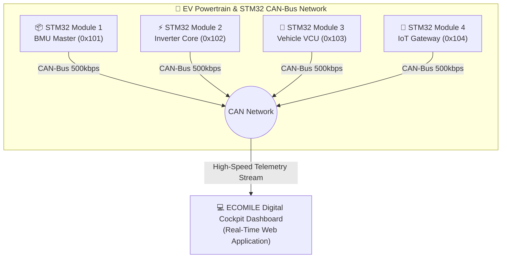

# ⚡ ECOMILE LAB: Quad STM32 CAN-Bus EV Telemetry & Cockpit Dashboard

> **High-Performance Real-Time Telemetry & Distributed Thermal Monitoring System for Electric Vehicles**  
> *Developed for Autonomous & EV Innovation Competitions*

---

## 🏆 Project Overview (ภาพรวมโครงการ)

**ECOMILE LAB Dashboard** คือระบบหน้าปัดดิจิทัลและศูนย์ควบคุมข้อมูลระยะไกล (EV Telemetry & Digital Cockpit) สำหรับยานยนต์ไฟฟ้าสมรรถนะสูง ออกแบบตามสถาปัตยกรรมเครือข่าย **CAN-Bus แบบกระจายศูนย์ (Distributed Multi-Node Architecture)** โดยเชื่อมต่อกับไมโครคอนโทรลเลอร์ **STM32 จำนวน 4 โหนด** เพื่อมอนิเตอร์ความร้อน, กำลังขับ, พลังงานไฟฟ้า และความปลอดภัยของตัวรถแบบ Real-Time 100%

---

## 🌟 Key Technical Features (ฟีเจอร์เด่นทางวิศวกรรม)

### 1. 🌡️ Quad STM32 Distributed Thermal Matrix (ระบบเฝ้าระวังอุณหภูมิ 4 โหนด)
* **Module 1 (0x101) - BMU Master (STM32F4)**: เฝ้าระวังอุณหภูมิและความปลอดภัยของชุดเซลล์แบตเตอรี่ (Battery Management Unit)
* **Module 2 (0x102) - Inverter Core (STM32G4)**: ตรวจสอบอุณหภูมิภาคขยายกำลัง Dual SiC MOSFET Inverter ขับเคลื่อนมอเตอร์
* **Module 3 (0x103) - Vehicle VCU (STM32H7)**: หน่วยประมวลผลคำนวณเวกเตอร์ขับเคลื่อน (Vehicle Control Unit)
* **Module 4 (0x104) - IoT Gateway (STM32F1)**: จัดการแพ็กเก็ตข้อมูลและเชื่อมต่อระบบส่งข้อมูล Telemetry
* **3-Tier Thermal Safety Logic**:
  * 🟢 **NORMAL** ($< 50^\circ\text{C}$): ประสิทธิภาพสูงสุด
  * 🟡 **WARNING** ($50^\circ\text{C} - 70^\circ\text{C}$): ควบคุมอุณหภูมิพร้อมแจ้งเตือน
  * 🔴 **CRITICAL** ($> 70^\circ\text{C}$): ตัดกำลังขับเพื่อความปลอดภัย (Thermal Throttling)

### 2. 🏎️ Sport Cockpit & Live 0-100 km/h Stopwatch (ระบบจับเวลาอัตราเร่งสด)
* **Digital Speedometer**: มาตรวัดความเร็วดิจิทัลแบบวงแหวนนีออนเรืองแสง (0 - 200 km/h)
* **Live 0-100 Stopwatch Engine**: ระบบตรวจจับการออกตัว (Launch Detection) และนับเวลาอัตราเร่ง 0-100 km/h สดๆ ทุกรอบการขับขี่ พร้อมล็อกเวลาสถิติอัตโนมัติเมื่อแตะ 100 km/h
* **Peak Speed Record**: สถิติความเร็วสูงสุดประจำรอบขับขี่ พร้อมฟังก์ชันคลิก Reset สถิติ
* **Drive Mode Dynamics**: เลือกโหมดขับขี่ **ECO / NORMAL / SPORT** เพื่อปรับแต่ง Throttle Response และอัตราเร่ง

### 3. ⚡ Real-Time Energy Analytics & Calculations (การวิเคราะห์พลังงาน)
* **Instant Power ($P$) & Motor Torque ($T$)**: คำนวณตามสูตรฟิสิกส์วิศวกรรมยานยนต์ไฟฟ้า:
  $$P = V \times I \quad (\text{kW})$$
  $$T = \frac{9549 \times P}{N} \quad (\text{Nm})$$
* **Energy Consumption ($E$)**: คำนวณพลังงานสะสมทั้งด้านการใช้พลังงานและพลังงานที่ประจุคืนจากการเบรก (Regenerative Braking):
  $$E_{\text{total}} = \int P \, dt \quad (\text{kWh})$$
* **Live Dynamic Dual-Axis Chart**: กราฟเส้นแสดงความเร็ว (Speed) ควบคู่กับกำลังไฟฟ้า (Power kW) แบบ Real-time

### 4. 🔋 Battery Pack & Estimated Range Model
* **State of Charge (SoC %)**: ระดับความจุแบตเตอรี่แบบละเอียด
* **Dynamic Range Algorithm**: คำนวณระยะทางที่วิ่งได้จริงตามพฤติกรรมการขับขี่และโหมดการทำงาน
* **Battery Pack SOH**: มอนิเตอร์สุขภาพแบตเตอรี่ (State of Health)

### 5. 🎨 Dual-Theme Engine (Dark Racing & Light Pro Mode)
* **Carbon Racing Dark Mode**: ธีมมืดดำคาร์บอนตัดเขียวนีออนสไตล์สนามแข่ง ถนอมสายตาสำหรับการขับขี่กลางคืน
* **Clean Pro Light Mode**: ธีมขาวสว่าง High-Contrast คมชัด อ่านง่ายกลางแจ้ง ไม่แยงสายตา

---

## 🛠️ Technology Stack (เทคโนโลยีที่ใช้)

* **Architecture**: Standalone Client-Side Web Application (No Server / Zero Build Dependency Required)
* **Core Engine**: HTML5, ECMAScript 2026 (Vanilla JavaScript)
* **Styling**: Tailwind CSS CDN, Custom Neon & Glassmorphism Keyframes
* **Data Visualization**: Chart.js Real-Time Stream Engine, SVG Dynamic Vector Path
* **Icons & Typography**: Lucide Icons CDN, Google Fonts (Orbitron, Chakra Petch, Inter)

---

## 🚀 How to Run Locally (วิธีเปิดใช้งาน)

1. ดาวน์โหลดหรือ Clone โฟลเดอร์โปรเจกต์นี้
2. ดับเบิลคลิกเปิดไฟล์ **`index.html`** ในเบราว์เซอร์ (Google Chrome, Microsoft Edge, Safari) ได้ทันที!
3. ไม่จำเป็นต้องติดตั้ง Node.js, npm หรือโปรแกรมจำลองเซิร์ฟเวอร์ใดๆ

---

## 👨‍💻 Developed by ECOMILE LAB Team

* **Project**: ECOMILE LAB Quad STM32 Dashboard Prototype
* **Target Application**: Energy-Efficient EV Racing, Telemetry Monitoring & Engineering Competitions
* **Repository**: [https://github.com/apiphoom11/ev-dashboard](https://github.com/apiphoom11/ev-dashboard)